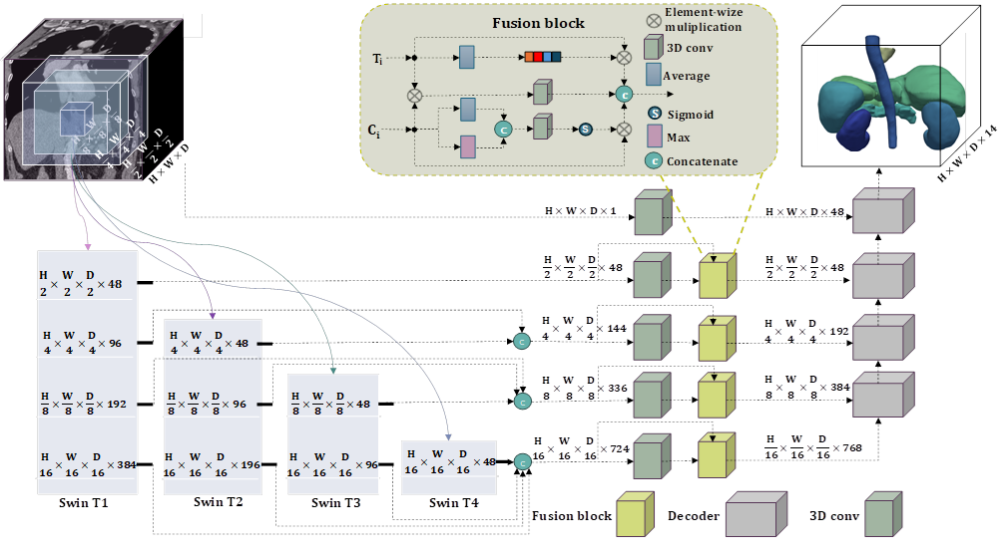

This is the official PyTorch implementation of the paper - "Multi-Aperture Fusion of Transformer-Convolutional Network (MFTC-Net) for 3D Medical Image Segmentation and Visualization".

### Multi-Aperture Fusion of Transformer-Convolutional Network (MFTC-Net) for 3D Medical Image Segmentation and Visualization



### Set Up Set Up Environment
```
python3.10 -m venv MFTCNet_env 
source MFTCNet_env/bin/activate 
pip install -r requirements.txt
```

### Dataset

Download data from: https://www.synapse.org/#!Synapse:syn3193805/wiki/89480

## Structure of data folders 

data/  
&nbsp;|---imagesTr/  
&nbsp;&nbsp;&nbsp;&nbsp;&nbsp;|---img0001.nii.gz  
&nbsp;&nbsp;&nbsp;&nbsp;&nbsp;|---img0002.nii.gz  
&nbsp;|---labelsTr/  
&nbsp;&nbsp;&nbsp;&nbsp;&nbsp;|---label0001.nii.gz  
&nbsp;&nbsp;&nbsp;&nbsp;&nbsp;|---label0002.nii.gz  
&nbsp;|---dataset.json  


### Running the Code

This repository is built upon the foundational work provided in [Synapse](https://github.com/LeonidAlekseev/Swin-UNETR). 


## Training

Before training the configs.json file should be filled:

### Hyperparameters Configuration
The following settings can be adjusted in the `config.py` to configure the model training and data management:

- **`data_dir`**: Set the directory path for dataset storage.
- **`saved_model_dir`**: Set the directory path where trained models and checkpoints will be saved.
- **`num_samples`**: Define the number of samples used in training process.
- **`num_classes`**: Specify the number of target classes in the dataset + background.
- **`input_size`**: Set the size of the input images or data.
- **`input_channels`**: Define the number of input channels for the data (e.g., grayscale=1, RGB=3).
- **`feature_size`**: Set the dimension of the feature vectors extracted by the model.
- **`use_checkpoint`**: Enable or disable the use of model checkpoints for training continuation.
- **`learning_rate`**: Set the initial learning rate for the optimizer.
- **`weight_decay`**: Define the weight decay (L2 penalty) rate for regularization.
- **`max_iterations`**: Specify the maximum number of iterations (or training steps).
- **`eval_num`**: Set the frequency of evaluations (every `eval_num` iterations) during training.


### train the model 

```
python3.10 main.py  
```
### Results

### Testing 
Comming soon 

### Citation
If any part of this code is used, please give appropriate citations to our paper. <br />

### Contact
If you have any questions, please email sshabani@unr.edu to discuss with the authors. <br />

